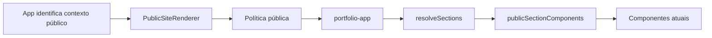
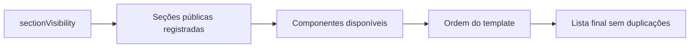

# Composição pública

## Escopo da Etapa 5

A composição pública do Site JD passou a ser interpretada pelo motor de templates. A mudança é estrutural: o visitante continua recebendo exatamente o mesmo portfólio, com as mesmas seções, ordem, conteúdo, rotas, modais, links e aparência.

Somente `portfolio-app` é público. Landing page, site institucional e profissional autônomo continuam definições internas de preview.

## 1. Responsabilidade do App.jsx

`App.jsx` permanece como shell de alto nível. Ele inicializa stores e autenticação, aplica aparência e metadados globais, interpreta a rota de projeto, mantém `pushState`, `replaceState` e `popstate`, controla os modais globais e preserva os imports lazy de painel, detalhe de projeto e modais.

O App não lista mais as seções públicas nem possui uma condicional de visibilidade para cada uma.

## 2. Responsabilidade do PublicSiteRenderer

`PublicSiteRenderer` normaliza uma cópia segura da configuração, consulta a política pública, cria um plano de renderização e entrega esse plano ao template de portfólio. Ele não acessa Supabase, localStorage ou APIs administrativas e não salva dados.

API:

```jsx
<PublicSiteRenderer
  requestedTemplateId={site.siteClassificationId}
  siteConfig={site}
  projects={projects}
  handlers={{ onLogin, onContact, onOpenProject }}
/>
```

## 3. Responsabilidade do PortfolioTemplate

`PortfolioTemplate` preserva a hierarquia pública:

```text
.site-shell
├── Header
├── main#conteudo
│   └── seções resolvidas
└── Footer
```

Ele recebe `template`, `sectionIds`, `siteConfig`, `projects` e `handlers`. O componente não escolhe template, não resolve persistência e não contém regras administrativas.

## 4. Registro de componentes

`publicSectionComponents.js` associa os oito IDs públicos aos componentes existentes por adapters pequenos:

- `hero` → `Hero`;
- `specialties` → `Specialties`;
- `projects` → `Projects`;
- `about` → `About`;
- `credibility` → `Credibility`;
- `resume` → `Resume`;
- `contact` → `Contact`;
- `footer` → `Footer`.

Os adapters apenas conectam props e callbacks. Não duplicam a lógica interna dos componentes.

## 5. Fluxo de resolução



Um ID futuro, legado ou inválido passa por `resolvePublicTemplate` e resulta em `portfolio-app`.

## 6. Fluxo de visibility

O plano usa o registro público para conhecer seções e anchors, cruza os IDs com componentes registrados e remove apenas entradas explicitamente marcadas como `false`. Uma visibilidade parcial mantém as demais seções, reproduzindo o comportamento anterior.



Seções ocultas não são reintroduzidas, inclusive Hero e Contato, preservando o comportamento da v1.8.5.

## 7. Ordem das seções

A ordem permanece:

1. Hero;
2. Especialidades;
3. Portfólio;
4. Sobre;
5. Credibilidade e trajetória;
6. Currículo;
7. Contato;
8. Footer.

O Header permanece antes do conteúdo e não é tratado como seção editorial.

## 8. Props e callbacks

O contexto de renderização contém somente `siteConfig`, `projects`, `templateId` e `handlers`. Os callbacks continuam pertencendo ao App:

- `onLogin` abre o painel;
- `onContact` abre o modal de contato;
- `onOpenProject` atualiza a rota pública.

Não foi criada Context API global.

## 9. Rotas

`appNavigation.js` concentra operações puras de URL sem mudar o roteamento:

- leitura de `/portfolio/:id`;
- criação de `/portfolio/:id` com encoding seguro;
- retorno para `/#projetos`.

O App continua usando History API e `popstate`. React Router não foi adicionado.

## 10. Modais

`ProjectModal`, `ContactModal` e `AdminPanel` permanecem globais no App e carregados de forma lazy. Eles não foram movidos para adapters de seção. Foco, Escape, backdrop e callbacks continuam sob os componentes existentes.

## 11. Política pública

`publicTemplatePolicy.js` permanece soberana. A classificação salva não publica template. LocalStorage, Supabase, backup, alias legado ou ID inválido não conseguem selecionar Landing Page, Institucional ou Profissional Autônomo para visitantes.

## 12. Tratamento de fallback

O plano público:

- normaliza configuração incompleta sem modificar a entrada;
- resolve template inválido como `portfolio-app`;
- ignora seção desconhecida;
- ignora seção sem componente registrado;
- remove duplicações;
- usa a ordem padrão quando a ordem recebida é inválida;
- aceita visibilidade inválida como configuração vazia.

## 13. Code splitting e bundle

Os imports lazy anteriores foram preservados. O resolvedor canônico de seções fica em `resolveSections.js` e não importa catálogos. `resolveTemplate.js` mantém a API histórica e injeta o registro completo para consumidores administrativos.

O carregamento público usa `publicSectionRegistry.js`, contendo apenas ID, anchor e obrigatoriedade das oito seções. Rótulos e metadados administrativos ficam em `sectionRegistry.js`, no caminho do painel. Assim, definições completas de templates futuros não entram no chunk inicial.

## 14. Limitações

- somente o template de portfólio possui componente público;
- templates futuros continuam apenas declarativos;
- SEO e metadados globais permanecem no App;
- componentes internos das seções não foram divididos;
- CSS global não foi reorganizado;
- AdminPanel não foi modularizado.

## 15. Etapa 6 futura

A Etapa 6 poderá evoluir edição ou preview dos templates futuros, mediante escopo e aprovação próprios. Ela não foi iniciada nesta mudança.

## Garantias de compatibilidade

- nenhum formato persistido foi alterado;
- nenhuma chave de localStorage foi alterada;
- nenhuma migration foi criada;
- nenhum Supabase real foi acessado;
- nenhuma alteração foi feita no Netlify;
- nenhum CSS foi alterado;
- AdminPanel não foi modularizado;
- Etapa 8 não foi executada.

## Atualização da Etapa 7

O item histórico “CSS global não foi reorganizado” descreve somente o escopo original da Etapa 5. Na versão 1.8.8, o CSS foi modularizado fisicamente sem alterar a composição React, a ordem das seções ou a política pública de templates. Consulte [ARQUITETURA_DE_ESTILOS.md](ARQUITETURA_DE_ESTILOS.md).
