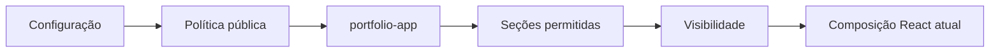
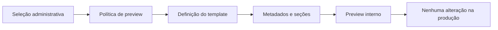

# Motor interno de templates

## Escopo da Etapa 4

Esta etapa cria um motor declarativo para representar diferentes composições de site sem reconstruir a aplicação pública. O Site JD continua sendo, para todo visitante, um **portfólio profissional**. Landing page, site institucional e site para profissional autônomo existem apenas como definições internas consultáveis no preview administrativo.

Não houve mudança de schema persistido, migration, RLS, Storage, RPC, Supabase, localStorage, backup, rotas ou deploy. A Etapa 8 não foi executada.

## 1. Classificação

Classificação descreve a finalidade comercial do site, por exemplo `portfolio-app`, `landing-conversion`, `institutional` ou `professional-services`. Ela continua armazenada no campo histórico `siteClassificationId` e pode orientar o conteúdo administrativo.

Uma classificação não publica um template, não altera aparência, não apaga conteúdo e não modifica visibilidade automaticamente.

## 2. Template

Template descreve a composição estrutural: seções disponíveis, ordem padrão, capacidades, ação principal e tipos de conteúdo suportados. As definições ficam em `src/templates/` e são registradas por `templateRegistry.js`.

Somente `portfolio-app` possui `publicEnabled: true`. Os templates futuros possuem `previewEnabled: true` e `publicEnabled: false`.

## 3. Conteúdo

Conteúdo continua sendo o conjunto de textos, projetos, contatos, especialidades, trajetória, métricas, tecnologias, currículo e depoimentos já mantido pelo `siteConfig` e pelos stores. Resolver ou visualizar um template não escreve nem transforma esse conteúdo.

## 4. Aparência

Aparência continua isolada em `appearance`: paleta, fonte, estilo, bordas, densidade e efeitos. Template não escolhe aparência, e aparência não escolhe nem publica template.

## 5. Visibilidade

Visibilidade permanece em `sectionVisibility`. O resolvedor puro considera apenas seções permitidas, ordem, disponibilidade e flags de visibilidade. Seções obrigatórias são preservadas; entradas desconhecidas são ignoradas.

## 6. Template registry

`templateRegistry.js` mantém as quatro definições canônicas, resolve aliases e sempre devolve cópias independentes. Suas funções públicas permitem listar templates, consultar uma definição, obter IDs e verificar disponibilidade para preview.

Cada definição declara:

- identidade, rótulo, descrição e status;
- permissão pública e de preview;
- seções permitidas e ordem padrão;
- capacidades;
- ação principal;
- conteúdo suportado, obrigatório e opcional;
- versão interna da definição;
- fallback seguro.

## 7. Section registry

`sectionRegistry.js` registra chaves estáveis, sem importar componentes React pesados. Cada seção pode descrever rótulo, finalidade, categoria, chave do componente público, editor administrativo, visibilidade padrão, obrigatoriedade e capacidades relacionadas.

As seções públicas atuais são `hero`, `specialties`, `projects`, `about`, `credibility`, `resume`, `contact` e `footer`. Seções conceituais futuras também são conhecidas, mas não são renderizadas publicamente nesta etapa.

## 8. Capabilities

`templateCapabilities.js` centraliza capacidades como projetos, filtros, estudos de caso, depoimentos, currículo, trajetória, métricas, especialidades, serviços, equipe, clientes, FAQ, captação de contato, contato, demonstração externa e Power BI incorporado.

As consultas são explícitas: um template só possui uma capacidade quando o valor correspondente é `true`. Uma capacidade inexistente retorna `false`.

## 9. Política pública

`publicTemplatePolicy.js` define `PUBLIC_TEMPLATE_ID = 'portfolio-app'`. A resolução pública não confia em valores persistidos ou administrativos.

Portanto, um ID vindo de localStorage, backup, Supabase, classificação administrativa ou importação não consegue publicar um template futuro. ID inválido também usa `portfolio-app`.

## 10. Política de preview

O contexto `admin-preview` aceita somente definições com `previewEnabled: true`. A seleção atual da classificação é reaproveitada; não foi criado um segundo campo persistido. A tela informa nome, descrição, seções, capacidades, status e que o preview não está publicado.

Classificações legadas sem template próprio usam fallback seguro apenas para os metadados do motor, sem alterar o valor salvo.

## 11. Resolução de template

`resolveTemplate({ requestedTemplateId, context })` é determinística e pura:

- `public`: retorna o template público seguro;
- `admin-preview`: retorna template habilitado para preview ou fallback;
- `admin-editor`: permite consultar qualquer definição registrada;
- contexto ou ID inválido: usa `portfolio-app`.

A função não acessa `window`, localStorage ou Supabase, não salva dados e não modifica seus argumentos.

## 12. Resolução de seções

`resolveSections({ template, visibility, preferredOrder, availableSections })`:

- limita a lista às seções conhecidas e permitidas;
- preserva ordem preferida válida e completa com a ordem padrão;
- remove duplicações;
- respeita visibilidade de seções opcionais;
- mantém seções obrigatórias;
- aceita uma lista de seções realmente disponíveis;
- não altera os objetos recebidos;
- retorna sempre uma nova lista.

Um `preferredOrder: []` é intencional e retorna apenas seções obrigatórias disponíveis. Quando a ordem não é fornecida, usa a ordem padrão do template.

## 13. Templates existentes

| ID canônico | Estado | Público | Preview | Finalidade |
|---|---|---:|---:|---|
| `portfolio-app` | estável | sim | sim | composição pública atual do Site JD |
| `landing-page` | preview | não | sim | oferta única e conversão |
| `institutional` | preview | não | sim | empresa, serviços e credibilidade |
| `professional-services` | preview | não | sim | perfil, serviços e atendimento profissional |

Nenhum componente completo foi criado para os três templates futuros.

## 14. Compatibilidade com classificações legadas

O valor persistido histórico `landing-conversion` possui alias seguro para a definição `landing-page`. Os valores `local-business`, `catalog`, `blog-editorial` e `event` continuam válidos como classificações, não são renomeados nem apagados e usam fallback de template no preview.

O alias atua somente na consulta ao registry. Ele não regrava dados existentes e não altera o formato do backup.

## 15. Limitações desta etapa

- a árvore pública ainda permanece composta diretamente em `App.jsx`;
- templates futuros exibem metadados e a prévia administrativa já existente, não páginas públicas completas;
- o registry referencia componentes por chaves, sem carregá-los;
- não existe novo campo de template em `siteConfig`;
- não há publicação seletiva de templates futuros;
- não houve modularização de `AdminPanel.jsx` nem reorganização de CSS.

## 16. Etapa 5 futura

A Etapa 5 poderá introduzir, mediante aprovação separada, um compositor público que transforme a lista resolvida de seções em componentes React. Essa evolução deverá reaproveitar os registries atuais, preservar a política pública, comparar novamente o baseline visual e manter conteúdo, aparência e persistência independentes.

Até lá, a integração em `App.jsx` é mínima: a política central fornece a classificação pública segura aos componentes que possuem variações de texto, sem mudar a ordem ou a renderização atual.
