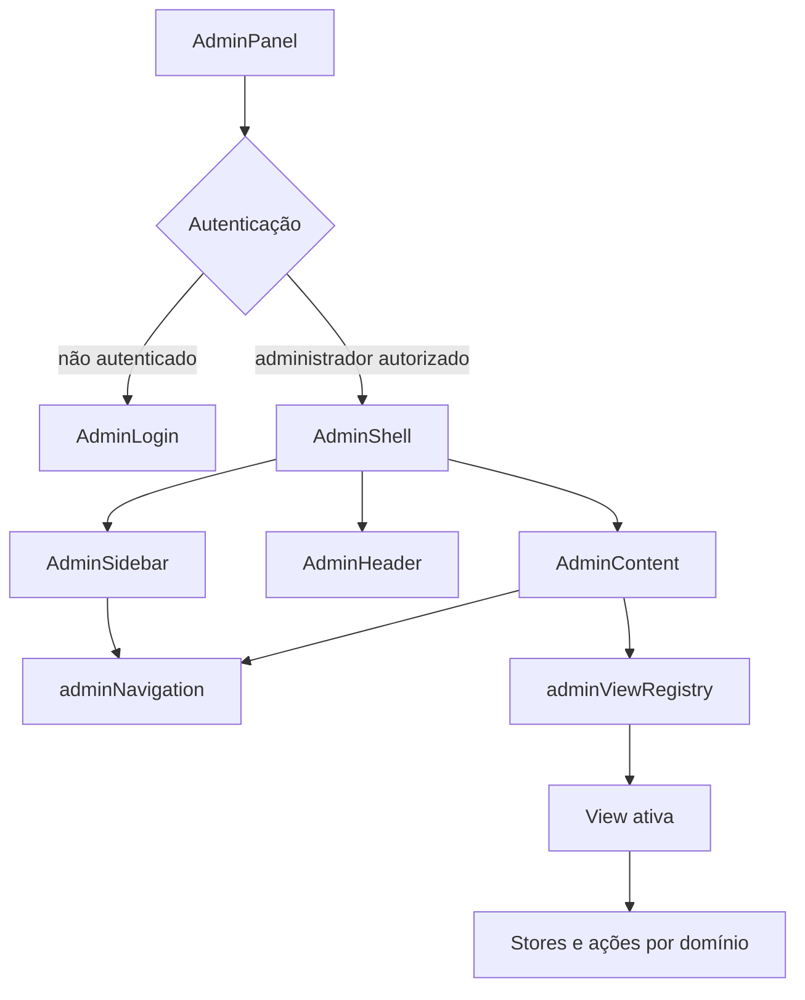

# Arquitetura do painel administrativo

**Versão:** 1.8.8
**Etapa:** 6 — modularização progressiva do painel

## Objetivo

O painel continua visual e funcionalmente equivalente à versão 1.8.6, mas deixou de concentrar shell, navegação, views e formulários em um único componente. A mudança é interna: não altera banco, persistência, CSS nem página pública.

## Arquitetura anterior

`AdminPanel.jsx` possuía 628 linhas e reunia:

- autenticação local e formulário de login;
- diálogo administrativo completo;
- sidebar, topbar e definição duplicada dos títulos;
- seleção e renderização condicional das dez áreas;
- visão geral e configurações;
- cadastro completo de projetos;
- upload de capa, galeria e currículo;
- importação e exportação de backup;
- estados de filtro, formulário, preview e sincronização.

O arquivo também importava diretamente oito áreas que já possuíam componentes próprios. Isso aumentava o risco de regressão e dificultava testar uma responsabilidade sem carregar todo o painel.

## Fluxo atual



## Responsabilidades

### AdminPanel

É o ponto de entrada lazy do painel. Mantém somente:

- abertura e fechamento do diálogo;
- integração de acessibilidade do modal externo;
- autenticação de alto nível;
- sessão local temporária de desenvolvimento;
- ID da view ativa e fallback seguro;
- encaminhamento dos stores para o shell;
- logout remoto ou local.

### AdminLogin

Mantém email, senha/PIN e erro local. O PIN temporário só pode ser lido quando `import.meta.env.DEV` é verdadeiro e não possui valor padrão. Em produção, o acesso continua dependendo do Supabase Auth.

### AdminShell

Preserva a hierarquia visual da versão 1.8.6:

```text
.admin-console
├── .admin-console__nav
└── .admin-console__main
    ├── .admin-console__topbar
    └── view ativa
```

Nenhuma classe CSS, ID ou regra responsiva foi reorganizada. No celular, a navegação continua sendo a grade sempre visível definida pelo CSS existente; a versão 1.8.6 não possuía drawer ou overlay recolhível administrativo.

### AdminSidebar

Renderiza marca, navegação, informação da sessão e logout. Desktop e celular usam a mesma coleção central. Setas para cima/baixo, `Home` e `End` movimentam o foco entre os itens sem criar uma segunda navegação.

### AdminHeader

Resolve o título da view e apresenta o mesmo status de salvamento anterior. Repositórios usam `projectStore.saveStatus`; as demais áreas usam `siteStore.saveStatus`.

### AdminContent

Normaliza a aba solicitada, consulta o registro e monta somente a view resolvida. Uma aba inválida, oculta ou sem componente usa a Visão geral como fallback e nunca tenta renderizar um componente inexistente.

## Navegação

`adminNavigation.js` centraliza, na ordem atual:

1. Classificação do site;
2. Visão geral;
3. Configurações;
4. Aparência;
5. Trajetória;
6. Repositórios;
7. Box/figurinhas;
8. Especialidades;
9. Mensagens, apenas quando o Supabase está configurado;
10. Guia do site.

Cada item declara `id`, `label`, `description`, `componentKey`, `icon` e, quando necessário, `title` ou `visibility`. Nenhuma permissão nova foi adicionada.

## Registro de views

`adminViewRegistry.js` relaciona chaves estáveis a componentes React. O registro não contém persistência, autorização, regras de template ou regras de negócio.

| Chave | View |
| --- | --- |
| `overview` | `DashboardView` |
| `settings` | `SettingsView` |
| `appearance` | `AppearanceView` |
| `classification` | `ClassificationView` |
| `professional` | `ProfessionalContentView` |
| `repositories` | `ProjectsView` |
| `library` | `LibraryView` |
| `specialties` | `SpecialtiesView` |
| `messages` | `MessagesView` |
| `guide` | `GuideView` |

## Estados

Os estados foram aproximados do seu domínio:

- **global do painel:** autenticação local e ID da view ativa;
- **autenticação:** email, senha/PIN e erro em `AdminLogin`;
- **projetos:** seleção, pesquisa, filtro, galeria, modelos e preview em `ProjectsView`;
- **configurações:** erro e referência do currículo em `SettingsView`;
- **derivado:** projeto selecionado, projetos filtrados e tipos salvos com `useMemo`;
- **modal:** modo de preview junto ao formulário de projetos;
- **sincronização:** continua pertencendo aos stores e é apenas exibida pelo cabeçalho.

Não foi criado estado global adicional e nenhuma biblioteca de gerenciamento de estado foi introduzida.

## Ações e callbacks

As ações permanecem agrupadas por domínio:

- autenticação: `AdminLogin` e `AdminPanel`;
- navegação e logout: `AdminShell` e `AdminSidebar`;
- projetos, modelos e imagens: `ProjectsView`;
- currículo e configurações: `SettingsView`;
- backup: `adminBackup.js`;
- leitura de arquivo: `adminUploads.js`;
- mensagens, aparência, classificação, biblioteca e especialidades: componentes existentes.

Os stores não são reunidos em um objeto genérico e suas APIs públicas permanecem inalteradas.

## Autenticação e autorização

O fluxo de segurança continua sendo:

1. Supabase Auth valida email e senha;
2. `useAdminAuth` consulta `portfolio_admins`;
3. somente usuário presente na allowlist recebe acesso;
4. usuário autenticado sem autorização é desconectado;
5. logout invalida a sessão;
6. o PIN local existe somente em desenvolvimento.

A autorização não foi movida para uma decisão apenas visual ou frontend. RLS, tabela de administradores e políticas do banco não foram alteradas.

## Projetos

`ProjectsView` mantém criação, edição, exclusão, ordenação, filtros, visibilidade, tipo, modelos, links, estudo de caso existente, preview, capa e galeria. O store continua sendo a fonte da coleção e do salvamento automático.

Nenhum campo avançado novo de estudo de caso foi criado nesta etapa.

## Uploads

Capas e prints continuam passando por `optimizeImage`, limites locais e conversão para Data URL ou Supabase Storage. A exclusão remota continua assíncrona e protegida contra falha secundária. O currículo continua aceitando somente PDF de até 10 MB quando Storage está disponível.

Bucket, MIME aceitos, políticas, URLs e caminhos remotos não foram alterados.

## Backup

`adminBackup.js` preserva o formato `version: 2` usado pela versão 1.8.6:

```json
{
  "version": 2,
  "exportedAt": "ISO-8601",
  "site": {},
  "projects": []
}
```

O importador continua aceitando o objeto atual e o array legado de projetos. Nenhuma credencial, sessão ou variável de ambiente entra no arquivo.

## Mensagens

`MessagesView` continua encapsulando `AdminMessages`. Listagem, estados, leitura, exclusão e autorização permanecem no componente e nos serviços existentes. Nenhuma tabela ou RPC foi alterada.

## Templates e aparência

Os quatro templates internos da Etapa 4 permanecem disponíveis somente para administração e preview. A política pública continua publicando exclusivamente `portfolio-app`.

As opções de aparência, variáveis CSS, temas, paletas, fontes, bordas, densidade, efeitos e restauração continuam no componente existente. Nenhum CSS foi reorganizado.

## Tratamento de erros

- login combina erro local e erro seguro do hook de autenticação;
- configurações mostram erros de currículo dentro da própria view;
- projetos mostram erros de validação, upload e backup no editor;
- IDs inválidos de view usam fallback seguro;
- ausência de componente apresenta estado vazio controlado;
- falha de remoção secundária no Storage não interrompe a edição local.

## Acessibilidade

- diálogo externo mantém `role="dialog"`, `aria-modal` e título associado;
- foco inicial permanece no botão de fechar;
- `Escape` fecha o painel externo;
- formulário de login funciona por Enter;
- sidebar possui nome acessível;
- navegação por teclado aceita setas, `Home` e `End`;
- botões de ícone mantêm rótulos acessíveis;
- preview interno preserva o botão próprio de fechamento da versão 1.8.6.

## Compatibilidade e limites

- nenhuma alteração no banco;
- nenhuma migration criada;
- nenhuma alteração em Supabase, RLS, RPC ou Storage;
- nenhuma alteração no site público;
- nenhum CSS reorganizado;
- nenhuma API de store alterada;
- nenhuma chave de `localStorage` alterada;
- formato de backup preservado;
- templates futuros não publicados;
- Etapa 8 não executada.

## Próxima etapa

A Etapa 7 poderá avaliar separadamente:

- lazy loading granular das views mais pesadas;
- drawer administrativo móvel, caso seja desejado como nova funcionalidade;
- cobertura de upload com arquivos reais em ambiente integrado;
- evolução funcional dos estudos de caso;
- refinamento de modais internos e foco aninhado.

Esses itens não fazem parte da Etapa 6 e não foram implementados aqui.

## Atualização da Etapa 7

As afirmações históricas de que o CSS não havia sido reorganizado pertencem à Etapa 6. Na versão 1.8.8, os estilos do painel foram separados em módulos físicos, preservando exatamente classes, cascata, responsividade e visual. Mensagens e sincronização permanecem em um módulo tardio para manter sua posição original. Consulte [ARQUITETURA_DE_ESTILOS.md](ARQUITETURA_DE_ESTILOS.md).
