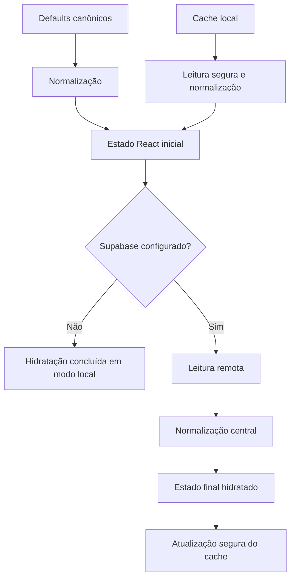
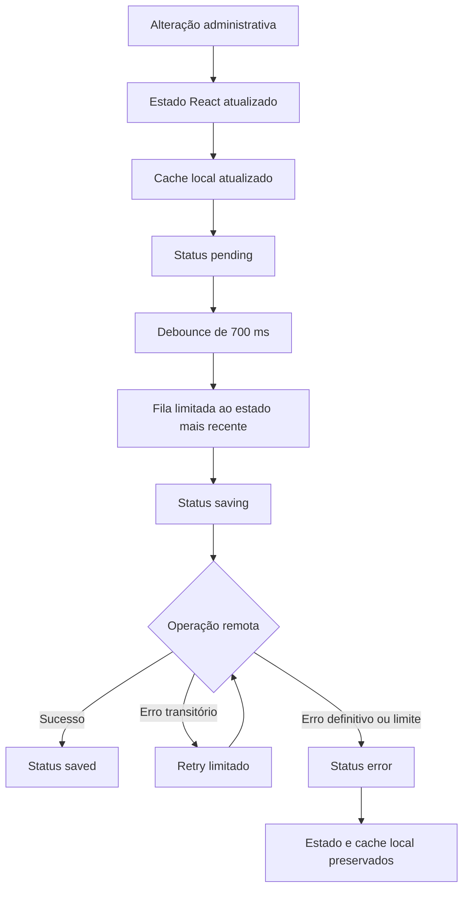
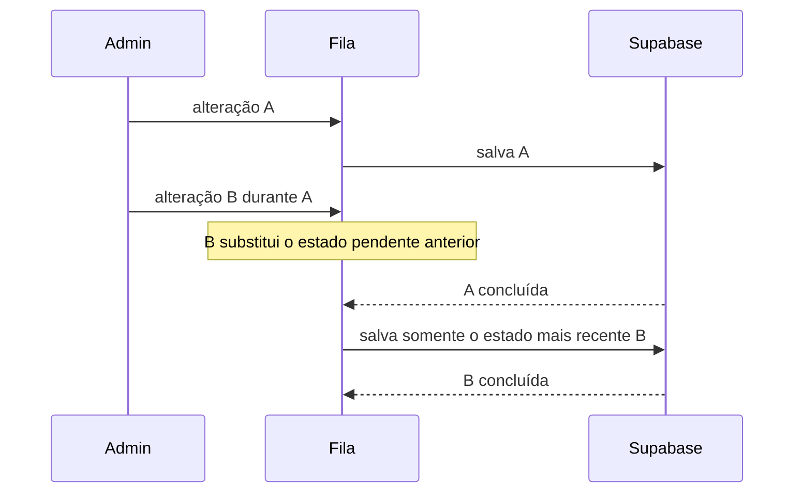

# Arquitetura de persistência

**Versão:** 1.8.4

**Escopo:** Etapa 3 — cache local, Supabase e coordenação de salvamentos

## Fontes e prioridade de carregamento

A interface começa com dados seguros sem aguardar a rede. Defaults e cache são normalizados antes do primeiro estado; quando o Supabase está configurado, sua resposta válida substitui o cache durante a hidratação.

Durante a hidratação, `setSite` e `setProjects` atualizam apenas o estado e o cache. A fila é acionada somente por operações administrativas explícitas; carregar ou normalizar dados não grava automaticamente no Supabase.

## Fluxo de escrita

## Módulos

| Módulo | Contrato e responsabilidade |
|---|---|
| `localStorageAdapter.js` | `readRaw`, `writeRaw`, `readJson`, `writeJson` e `remove`; captura indisponibilidade, JSON inválido, serialização e quota. |
| `supabaseAdapter.js` | `loadSiteConfig`, `saveSiteConfig`, `loadProjects`, `saveProjects` e `deleteProject`; recebe um cliente injetável e não normaliza conteúdo. |
| `persistenceQueue.js` | `enqueue`, `flushNow`, `cancelPending`, `dispose`, `getState` e `isDisposed`; concentra debounce, coalescência, concorrência local e retry. |
| `persistenceStatus.js` | Estados internos consistentes: `idle`, `loading`, `pending`, `saving`, `saved`, `offline` e `error`. |
| `useSiteStore.js` | Normaliza configurações, coordena cache, hidratação e fila de um documento `site_settings.data`. |
| `useProjectStore.js` | Normaliza projetos e converte mudanças em operações individuais de `portfolio_projects`. |

## Cache local

As chaves permanecem exatamente:

- `jd-portfolio-site-v1`;
- `jd-portfolio-projects-v1`;
- `jd-contact-last-submit`.

O adaptador não depende de `window`, não apaga caches antigos e não altera o valor recebido. JSON inválido ou armazenamento indisponível usa o fallback atual. Falha de escrita preserva o estado da sessão e gera uma mensagem amigável, sem expor detalhes técnicos.

## Supabase

O cliente é injetado em `createSupabaseAdapter`, permitindo testes com mocks. O adaptador conhece somente tabelas, colunas e operações já existentes:

- `site_settings`: leitura de `data` e `upsert` de `{ id, data, updated_at }`;
- `portfolio_projects`: leitura ordenada e `upsert` das linhas individuais;
- exclusão de projeto pelo mesmo `id` atual.

Normalização, classificação, aparência, textos e interface React não pertencem ao adaptador.

## Debounce, fila e concorrência local

O debounce permanece em 700 ms. A fila mantém somente o snapshot mais recente, em vez de acumular todos os estados intermediários.

Nos projetos, as operações são consolidadas por ID. Uma exclusão mais recente substitui um `upsert` pendente do mesmo projeto e é executada depois de uma requisição antiga em andamento, evitando recriação por resposta fora de ordem. Não existe sincronização entre abas ou dispositivos.

## Retry e erros

- máximo de três tentativas;
- atrasos progressivos existentes de 2 e 4 segundos;
- retry somente para rede, timeout, limites temporários e respostas potencialmente transitórias;
- erros definitivos encerram imediatamente as tentativas;
- falhas não removem estado nem cache;
- uma nova alteração permite nova tentativa com o estado mais recente;
- `dispose` cancela timers e impede atualização de status após desmontagem.

## Backups e formatos preservados

A exportação e importação continuam usando o mesmo envelope e os mesmos validadores. A configuração importada passa por `normalizeSiteConfig`; projetos passam por `normalizeProjectData`. Não foram alterados:

- `site_settings.data`;
- linhas de `portfolio_projects`;
- IDs, URLs, imagens, posições, `featured`, classificação, aparência ou visibilidade;
- estrutura dos backups;
- API pública dos hooks.

## Limites e etapas futuras

Esta etapa trata apenas concorrência dentro de uma instância da aplicação. Não há evento `storage`, sincronização entre abas, locking entre dispositivos ou controle de revisão no banco. Não foi criado motor de templates.

A Etapa 8 permanece cancelada: nenhuma migration, coluna, política RLS, RPC, bucket, CAPTCHA ou alteração no Supabase foi criada ou preparada.
